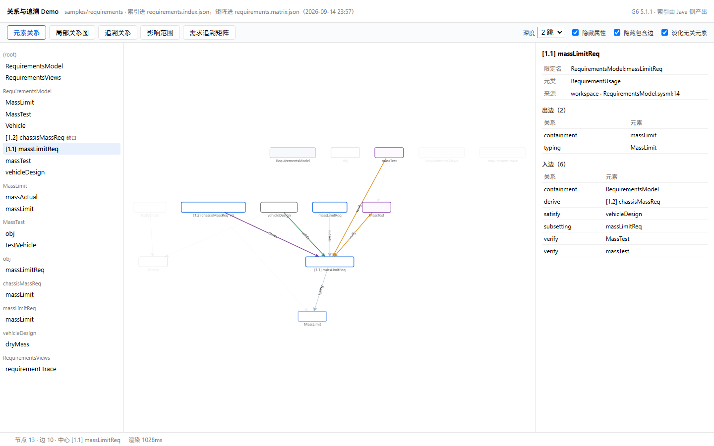
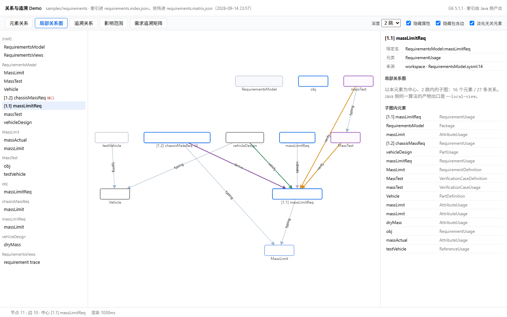
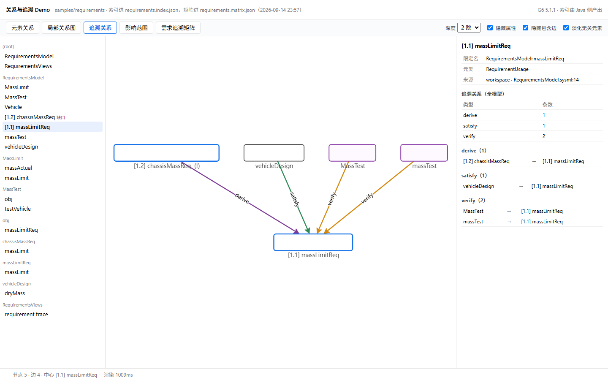
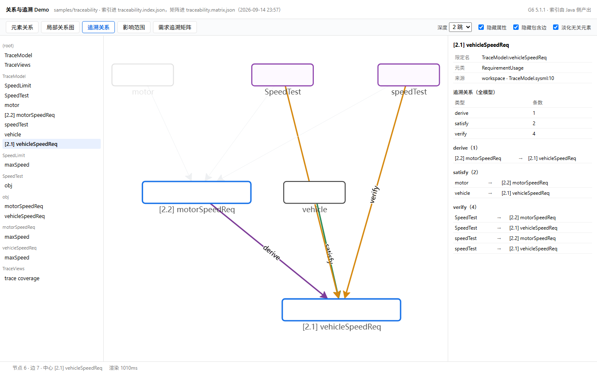
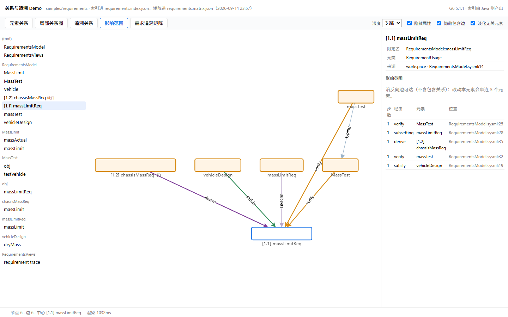
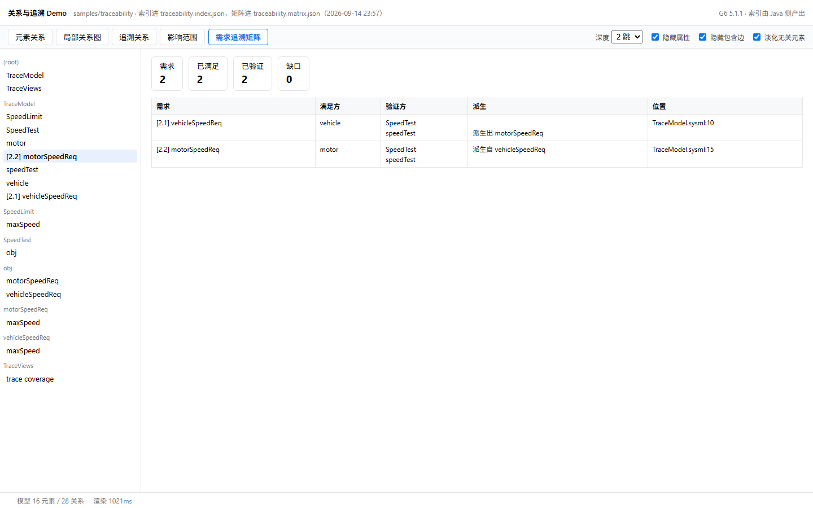

# 关系与追溯 Demo（G6 展示层）

用途：把阶段 3 已经做出来的四类语义能力——**元素关系、局部关系图、追溯关系、影响范围**——
加上**需求追溯矩阵**，用选定的 G6 展示层重做一遍，做成一个可以点、可以看的 Demo。

日期：2026-09-14。生成器 `scripts/make-relation-demo.py`，截图工具 `scripts/measure-proto.py`。
文中的图都是无头 Chrome 打开 Demo 页后的实机截图（1440×900），不是示意图。

## 1. Demo 长什么样

单文件 HTML（G6 与数据全部内联），双击即开、不联网、不起服务。左边是元素列表（按所属包分组，
有缺口的需求带红标），中间是图，右边是随模式变化的面板，顶上五个模式页签：

**元素关系 · 局部关系图 · 追溯关系 · 影响范围 · 需求追溯矩阵**

两个演示工作区：

| 工作区 | 用途 | 规模 |
|---|---|---|
| `samples/requirements` | 满足 + 验证 + 派生，并且**故意留了一个缺口** | 18 元素 / 28 关系，需求 2 |
| `samples/traceability` | 满足 + 验证 + 派生都齐，**没有缺口** | 16 元素 / 28 关系，需求 2 |

## 2. 元素关系

点任意元素把它设为**中心**：与中心直接相连的元素保持实色，其余淡化到 16% 不透明度，
边按关系类型着色。右面板给出这个元素的限定名、元类、来源位置，以及**出边 / 入边两张表**——
每条都标出关系类型，并区分「作者写的」与「推导出来的」（推导的标"推导"）。



图中中心是 `[1.1] massLimitReq`：入边 6 条（`containment`、`derive`、`satisfy`、`subsetting`、
`verify` ×2），出边 2 条（`containment`、`typing`）。左上角的红标说明 `[1.2] chassisMassReq`
在矩阵里是缺口。

## 3. 局部关系图

把中心元素周围 **N 跳**（面板上可选 1/2/3）内的子图单独画出来：节点是 N 跳可达的元素，
边是两端都在这个集合里的关系。图以外的元素完全不画，所以小范围排查时不会被整模型的噪声干扰。



这是 `massLimitReq` 的 2 跳子图：**16 个元素 / 27 条关系**。Java 侧同一算法的产物出口是
`run-view.ps1 --local-view`（产物变换，可继续走 SVG/PNG/交互页）；Demo 页里为了交互流畅，
把同一套算法放在页内跑。

## 4. 追溯关系

只保留 `satisfy`（满足）、`verify`（验证）、`derive`（派生）三类关系，其余边全部让位。
需求节点按需求号加粗显示，右面板按类型给出全模型的条数与逐条清单，点任一端可跳过去。



换到没有缺口的那份工作区，追溯链完整闭合：整车速度需求被 `vehicle` 满足、被 `speedTest`
验证，并且派生出电机速度需求；电机需求同样被满足和验证。



右面板的分组计数：`derive` 1 条、`satisfy` 2 条、`verify` 4 条。

## 5. 影响范围

"改动这个元素会牵连谁"：从选中元素出发沿**反向**边做可达（只跟随打字/特化/子集化/重定义/
满足/验证/派生/分配/流/连接/执行/时序这些关系，**不跟包含关系**——包含是结构不是依赖，
跟它会把所在包也算成受影响）。命中的元素在图上高亮，右面板给出**步数 / 经由 / 元素 / 源码位置**。



`massLimitReq` 的影响范围是 5 个元素，全部在 1 跳内：`vehicleDesign`（satisfy）、`MassTest`
与 `massTest`（verify）、`chassisMassReq`（derive）、以及 `MassTest::obj::massLimitReq`（subsetting）。

## 6. 需求追溯矩阵

以需求为行、以关系为列的稀疏矩阵，顶部四块统计：需求 / 已满足 / 已验证 / 缺口。有缺口的行
整行标红，点任意一行就跳到图上以该需求为中心。


`samples/requirements`：需求 2、已满足 1、已验证 1、**缺口 1**。`[1.2] chassisMassReq` 是缺口——
它由 `[1.1]` 派生而来，但既没有满足方也没有验证方。这正是覆盖率门禁要拦的情况
（`run-view.ps1 -Matrix -GapsOnly -Gate` 会以退出码 4 结束）。

对照工作区没有缺口，同一个界面直接显示为 0：



## 7. 正确性核对

Demo 页里的三个语义计算是**照 Java 侧 `ModelQuery` 的算法实现**的（同一套边类型集合、
同样的反向可达与排序），因此可以直接与命令行输出对照：

| 量 | Demo 页 | Java 命令 | 一致 |
|---|---|---|---|
| `massLimitReq` 影响范围 | 5 个元素（全部 1 跳） | `--query impact --ref RequirementsModel::massLimitReq --depth 3` → 合计 5 个 | ✅ |
| `massLimitReq` 2 跳子图 | 16 节点 / 27 边 | `--query subgraph --ref … --depth 2` → nodes=16 edges=27 | ✅ |
| `requirements` 矩阵 | 需求 2 / 已满足 1 / 已验证 1 / 缺口 1 | `--matrix` → requirements=2 satisfied=1 verified=1 gaps=1 | ✅ |

## 8. 展示层怎么映射

页面只吃语义数据，没有任何"猜语义"的规则：

| 语义（索引 / 矩阵） | 展示 |
|---|---|
| `metaclass` | 节点形状与颜色：需求（蓝框）、需求定义（浅蓝）、验证（紫框）、部件（黑框）、包（灰）、属性（浅灰） |
| `reqId` | 需求节点前缀 `[1.1]`，与矩阵行标题一致 |
| `origin` | 库元素不画（工作区元素才进图） |
| `relations[].kind` | 边颜色与标签：`satisfy` 绿、`verify` 橙、`derive` 紫、`typing`/`subsetting`/`redefinition` 冷色细线 |
| `relations[].authored` | 面板里区分"作者写的"与"推导" |
| `matrix.rows[].satisfiedBy/verifiedBy` | 缺口判定与红标，矩阵行内容 |
| `source.uri` + `source.line` | 面板与影响范围表里的位置列（只显示文件名 + 行号） |

布局用 G6 的 `antv-dagre`（自上而下），默认藏掉属性节点与包含边——Demo 讲的是关系与追溯，
包含边只会把图铺开。两个开关都在页面上，随时可以打开。

## 9. 怎么复现

```powershell
# 1. 生成索引与追溯矩阵（只跑小样例，单次十秒级）
powershell -ExecutionPolicy Bypass -File scripts\run-view.ps1 -Workspace samples/requirements `
    -Index build\demo-data\requirements.index.json
powershell -ExecutionPolicy Bypass -File scripts\run-view.ps1 -Workspace samples/requirements `
    -Matrix -Out build\demo-data\requirements.matrix.json

# 2. 生成单文件 Demo 页
python scripts\make-relation-demo.py --workspace samples/requirements `
    --out build\demo\requirements.html `
    --lib build\vendor\node_modules\@antv\g6\dist\g6.min.js --reuse

# 3. 截图（可选）：脚本化切模式后截屏
python scripts\measure-proto.py --html build\demo\requirements.html `
    --shot docs\images\relation-demo\01-relation.png `
    --call "window.__PROTO.run('mode','impact')"
```

依赖：`build/vendor/node_modules` 下的 `@antv/g6@5.1.1`（不进仓库）；`--reuse` 表示复用
`build/demo-data` 里已有的索引与矩阵，不重跑 Java。

## 10. 已知限制

- **不是产品形态**：单文件页、面向演示；没有导出、没有跨视图跳转按钮、没有视图 expose 的边界概念
  （数据是**全模型**索引口径，这一点与矩阵、影响范围一致）。
- **端口与仓格没进这个 Demo**：它讲的是元素间关系，不是单个元素内部结构；那部分在
  `docs/GRAPH-LIB-P1.md` 的原型里（端口、嵌套、仓格）。
- **依赖索引全量加载**：演示规模是几十个元素；真实模型上千元素时需要先筛（按包、按需求号）
  再画，页内计算目前是全量遍历。
- **截图是无头渲染的结果**：鼠标拖动、缩放、悬停高亮这些交互在静态图里看不出来，需要打开页面体验。

## 11. 下一步

| 项 | 说明 |
|---|---|
| 局部关系图接 `--local-view` | 现在页内自己算；接上 Java 产物后可以复用同一份 SVG/PNG 导出 |
| 影响范围可视化加强 | 现在只有一层高亮；按步数分色、或做"改动前后对比" |
| 矩阵筛选与导出 | 按包/需求号筛、导出 CSV 或 Markdown，便于进评审材料 |
| 跨视图跳转 | 索引里已带 `views[]`，可以在面板上给出"这个元素出现在哪些视图"并跳转 |
| 大模型策略 | 先筛后画：按包/需求号限定范围，再走"关系 → 局部图"的路径 |
