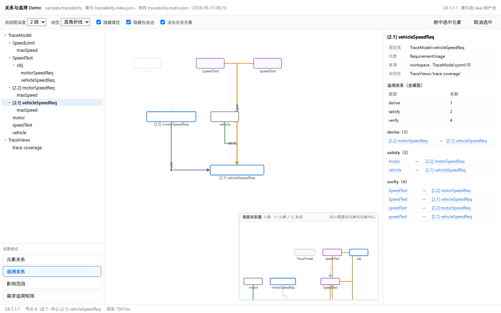
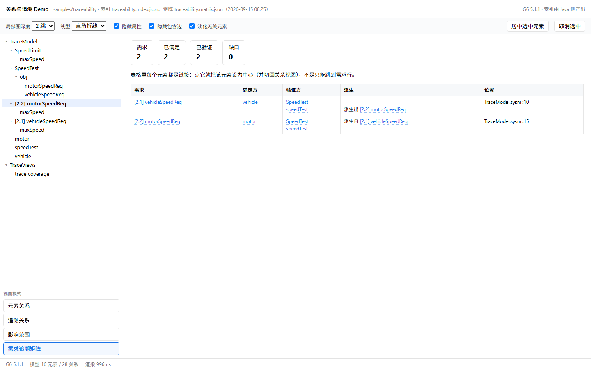
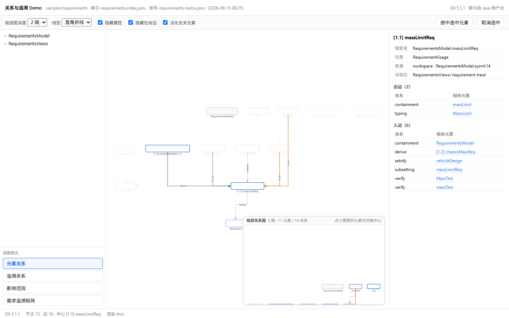

# 关系与追溯 Demo（G6 展示层）

用途：把阶段 3 已经做出来的四类语义能力——**元素关系、局部关系图、追溯关系、影响范围**——
加上**需求追溯矩阵**，用选定的 G6 展示层重做一遍，做成一个可以点、可以看的 Demo。

日期：2026-09-15（第二版，按使用反馈改了交互与版面）。生成器 `scripts/make-relation-demo.py`，
截图工具 `scripts/measure-proto.py`。文中的图都是无头 Chrome 打开 Demo 页后的实机截图
（1440×900），不是示意图。

## 1. Demo 长什么样

单文件 HTML（G6 与数据全部内联），双击即开、不联网、不起服务。版面：

```
┌──────────────────────────────────────────────────────────────┐
│ 标题 · 工作区 · 状态                                          │
├──────────────────────────────────────────────────────────────┤
│ 局部图深度 │ 线型 │ 隐藏属性 │ 隐藏包含边 │ 淡化无关 │ 居中 │ 取消 │
├────────────┬─────────────────────────────────┬───────────────┤
│ 元素树      │ 主图                             │ 详情 / 关系表  │
│ （可折叠）  │                    ┌───────────┐ │ （元素是链接） │
│            │                    │ 局部关系图 │ │               │
│ 视图模式    │                    └───────────┘ │               │
└────────────┴─────────────────────────────────┴───────────────┘
```

- **左侧栏**：元素树（按命名空间层级、可折叠，有缺口的需求带红标）+ 下方是**视图模式**列表。
  模式不再占上方横栏——横栏留给标题与筛选，模式再多也只是侧栏往下排。
- **右下角**：**常驻的局部关系图**，跟着当前选中元素和深度实时更新，与主视图同步（同一套筛选）。
- **右侧栏**：当前元素的详情与关系表；**表里的每个元素都是链接**，点谁就选中谁。

四个模式：元素关系 · 追溯关系 · 影响范围 · 需求追溯矩阵。
两个演示工作区：`samples/requirements`（满足/验证/派生齐全，**故意留一个缺口**，18 元素 / 28 关系）
与 `samples/traceability`（全部闭合，无缺口，16 元素 / 28 关系）。

## 2. 元素关系

点任意元素把它设为**中心**：与中心直接相连的元素保持实色，其余淡化到 16%，边按关系类型着色。
右侧给出限定名、元类、来源位置、**出现在哪些视图**，以及出边 / 入边两张表——每条标出关系类型，
区分「作者写的」与「推导的」。


中心 `[1.1] massLimitReq`：出边 2 条（`containment`、`typing`）、入边 6 条（`containment`、
`derive`、`satisfy`、`subsetting`、`verify` ×2）。右下角小图是它 2 跳内的局部关系图
（11 元素 / 10 关系，已跟随"隐藏属性 / 隐藏包含边"的筛选）。

## 3. 局部关系图（右下角常驻）

以当前中心为起点、N 跳（1/2/3）内的子图，画在右下角的小画布上，**与主视图同时可见**：
主图看全貌，小图看邻域；点小图里的元素可以直接换中心。小图里的中心元素带 `▶` 前缀。


小图用的是无向邻域（结构视角，所有关系类型），主图用的是当前模式（语义视角，可能只留追溯边）。
两者同屏是有意的：**同一份数据的两种切法**，切模式时不会互相顶掉。

Java 侧同一算法的产物出口是 `run-view.ps1 --local-view`（产物变换，可继续走 SVG/PNG/交互页）。

## 4. 追溯关系

只保留 `satisfy`（满足）、`verify`（验证）、`derive`（派生）三类关系，其余让位；需求节点按需求号
加粗。右面板按类型给出全模型条数与逐条清单，两端都是链接。


换到没有缺口的那份工作区，追溯链完整闭合：整车速度需求被 `vehicle` 满足、被 `speedTest` 验证，
并派生出电机速度需求；电机需求同样被满足和验证。



## 5. 影响范围

"改动这个元素会牵连谁"：从选中元素出发沿**反向**边做可达（只跟随 typing / specialization /
subsetting / redefinition / satisfy / verify / derive / allocate / flow / connection / perform /
succession，**不跟包含关系**——包含是结构不是依赖）。命中元素在图上高亮，右面板给出
步数 / 经由 / 元素 / 源码位置，元素同样是链接。


`massLimitReq` 的影响范围是 5 个元素：`vehicleDesign`（satisfy）、`MassTest` 与 `massTest`（verify）、
`chassisMassReq`（derive）、`MassTest::obj::massLimitReq`（subsetting）。

## 6. 需求追溯矩阵

以需求为行、以关系为列的稀疏矩阵，顶部四块统计：需求 / 已满足 / 已验证 / 缺口；缺口的行整行标红。
**表格里每个元素都是链接**：点满足方就跳到满足方，点需求行才跳到需求，不是只能跳到需求行。


`samples/requirements`：需求 2、已满足 1、已验证 1、**缺口 1**——`[1.2] chassisMassReq` 由 `[1.1]`
派生而来，但既没有满足方也没有验证方。这正是覆盖率门禁要拦的情况
（`run-view.ps1 -Matrix -GapsOnly -Gate` 以退出码 4 结束）。对照工作区没有缺口，同一界面显示为 0：



## 7. 树的折叠与浏览

元素树按**命名空间层级**搭（不是按包含边），有折叠箭头；横栏里还留着"全部展开/折叠"这类入口的
位置。缺口的元素在树上就有红标，不必进矩阵才能发现。



## 8. 交互约定（按使用反馈定的）

| 反馈 | 现在的行为 |
|---|---|
| 元素树不像树 | 真树：命名空间层级 + 折叠箭头 + 缩进，可全部展开/折叠 |
| 关系表里元素不是链接 | 面板与矩阵里的元素一律是可点的链接（蓝字 + 虚线下划线 + hover 下划线） |
| 模式占上方横栏、多了放不下 | 模式列表移到左侧栏下方，纵向排列；横栏只放标题与筛选 |
| 局部关系图希望单独放右下角、与主视图同步 | 右下角常驻小画布，跟随选中元素与深度实时更新，套用同一套筛选，点小图可换中心 |
| 矩阵只能跳到需求 | 单元格级链接：满足方/验证方/派生方各自可点，点谁选谁 |
| 选中后无法取消 | 点画布空白处、或按 `Esc`、或工具栏"取消选中" |
| 选中后自动居中、视图跳得厉害 | **选中只改高亮，不动视口**；要居中得显式动作：双击节点、工具栏"居中选中元素"、或在树上再点一次同一元素 |
| 线型只有直线 | 默认**直角折线**（G6 polyline + `router: {type:'orth'}`），横栏可切直线 / 圆滑曲线 |

第 7 条有数字可查（页内操作历史，见"正确性核对"）：连续两次选中，视口一模一样；只有显式居中才变。

## 9. 正确性核对

页内三个语义计算照 Java 侧 `ModelQuery` 的算法实现，可与命令行逐项对照：

| 量 | Demo 页 | Java 命令 | 一致 |
|---|---|---|---|
| `massLimitReq` 影响范围 | 5 个元素（全部 1 跳） | `--query impact --ref RequirementsModel::massLimitReq --depth 3` → 合计 5 | ✅ |
| `massLimitReq` 2 跳子图 | 16 节点 / 27 边 | `--query subgraph --ref … --depth 2` → nodes=16 edges=27 | ✅ |
| `requirements` 矩阵 | 需求 2 / 已满足 1 / 已验证 1 / 缺口 1 | `--matrix` → requirements=2 satisfied=1 verified=1 gaps=1 | ✅ |

视口行为（`window.__PROTO.report().history`，由 `scripts/measure-proto.py` 取回）：

| 操作 | 模式 | zoom | 平移 |
|---|---|---|---|
| 选中 `massLimitReq` | relation | 0.616 | [16, 288] |
| 再选中 `vehicleDesign` | relation | 0.616 | [16, 288] ← **没动** |
| 显式居中 `vehicleDesign` | relation | 0.616 | [176, 374] ← 只有这一步动 |
| 切到影响范围 | impact | 0.616 | [249, 150] ← 缩放保留、按新内容重新居中 |

## 10. 展示层怎么映射

| 语义（索引 / 矩阵） | 展示 |
|---|---|
| `metaclass` | 节点形状与颜色：需求（蓝框）、需求定义（浅蓝）、验证（紫框）、部件（黑框）、包（灰）、属性（浅灰） |
| `reqId` | 需求节点前缀 `[1.1]`，与矩阵行标题一致 |
| `origin` | 库元素不进图（只画工作区元素） |
| `views[]` | 右侧"出现在"一栏列该元素所属视图 |
| `relations[].kind` | 边颜色与标签：`satisfy` 绿、`verify` 橙、`derive` 紫、typing/subsetting/redefinition 冷色细线 |
| `relations[].authored` | 关系表里区分"作者写的"与"推导" |
| `matrix.rows[]` | 缺口判定与红标、矩阵单元格链接 |
| `source.uri` + `source.line` | 位置列（只显示文件名 + 行号） |

布局用 G6 `antv-dagre`（自上而下）。默认藏属性节点与包含边——Demo 讲的是关系与追溯，
包含边只会把图铺开；两个开关都在横栏上。

## 11. 追溯关系与影响范围：是"局部关系的扩展"吗

不是扩展关系，而是**同一份索引上的三种不同遍历**，共用一个底座（全模型索引 + BFS），
差别在"跟随哪些边、朝哪个方向、画成什么"：

| | 局部关系图（右下角） | 追溯关系 | 影响范围 |
|---|---|---|---|
| 跟随的边 | 全部关系类型 | 只有 `satisfy` / `verify` / `derive` | 依赖类边（12 种），**排除包含** |
| 方向 | 无向（结构邻域） | 有向（需求 ← 满足/验证/派生） | **反向**可达（改动会牵连谁） |
| 起点 | 当前选中元素 | 当前选中元素（或全模型视角） | 当前选中元素 |
| 回答的问题 | "它周围有什么" | "这条需求由谁满足、被谁验证、从哪派生" | "改了它会波及什么" |
| 画在哪 | 右下角小图，常驻 | 主图（过滤模式）＋右侧清单 | 主图高亮 ＋右侧按步数分层的表 |

因此实现上三者共用 `neighbors` / `subgraph` / `impact` 三个函数（页内与 Java 侧同名同算法），
展示上互不抢占位置：邻域常驻小图、追溯是主图的过滤模式、影响范围是主图高亮加分层表，
矩阵则是同数据的表格化（点单元格回到图）。后续如果要加"跨视图跳转"或"按包下钻"，
也走同一个底座，不需要新的语义计算。

## 12. 怎么复现

```powershell
# 1. 生成索引与追溯矩阵（只跑小样例，单次十秒级）
powershell -ExecutionPolicy Bypass -File scripts\run-view.ps1 -Workspace samples/requirements `
    -Index build\demo-data\requirements.index.json
powershell -ExecutionPolicy Bypass -File scripts\run-view.ps1 -Workspace samples/requirements `
    -Matrix -Out build\demo-data\requirements.matrix.json

# 2. 生成单文件 Demo 页
python scripts\make-relation-demo.py --workspace samples/requirements `
    --out build\demo\requirements.html `
    --lib build\vendor\node_modules\@antv\g6\dist\g6.min.js --reuse

# 3. 截图 / 脚本化交互（可选）
python scripts\measure-proto.py --html build\demo\requirements.html `
    --shot docs\images\relation-demo\01-relation.png `
    --call "window.__PROTO.run('mode','impact')"
```

页面暴露的脚本接口：`run('center'|'link'|'treePick'|'clear'|'centerView'|'mode'|'depth'|'filter'|
'edgeKind'|'collapseAll'|'expandAll'|'row', arg)`，`report()` 给指标与操作历史。

## 13. 已知限制

- **不是产品形态**：单文件页、面向演示；没有导出、没有跨视图跳转按钮；数据是**全模型**索引口径
  （与矩阵、影响范围一致），没有视图 `expose` 的边界概念。
- **端口与仓格不在这个 Demo 里**：它讲元素之间的关系，不是单个元素内部结构；那部分见
  `docs/GRAPH-LIB-P1.md`（端口、嵌套、仓格）。
- **大模型要先筛后画**：演示规模是几十个元素；上千元素时应先按包/需求号限定范围，
  目前页内计算是全量遍历。
- **静态截图看不到交互**：拖动、缩放、悬停高亮、动画需要在浏览器里实际操作。

## 14. 下一步

| 项 | 说明 |
|---|---|
| 局部关系图接 `--local-view` | 现在页内自己算；接上 Java 产物后可复用同一份 SVG/PNG 导出 |
| 影响范围分层着色 | 目前命中元素同色，按步数分色更直观 |
| 矩阵筛选与导出 | 按包/需求号筛选，导出 CSV/Markdown 便于进评审材料 |
| 跨视图跳转 | 索引已带 `views[]`，面板上给出"出现在哪些视图"并支持跳过去 |
| 大图策略 | 先筛后画：按包/需求号限定范围，再走"关系 → 局部图"的路径 |
