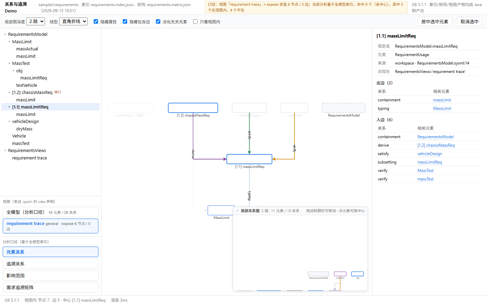
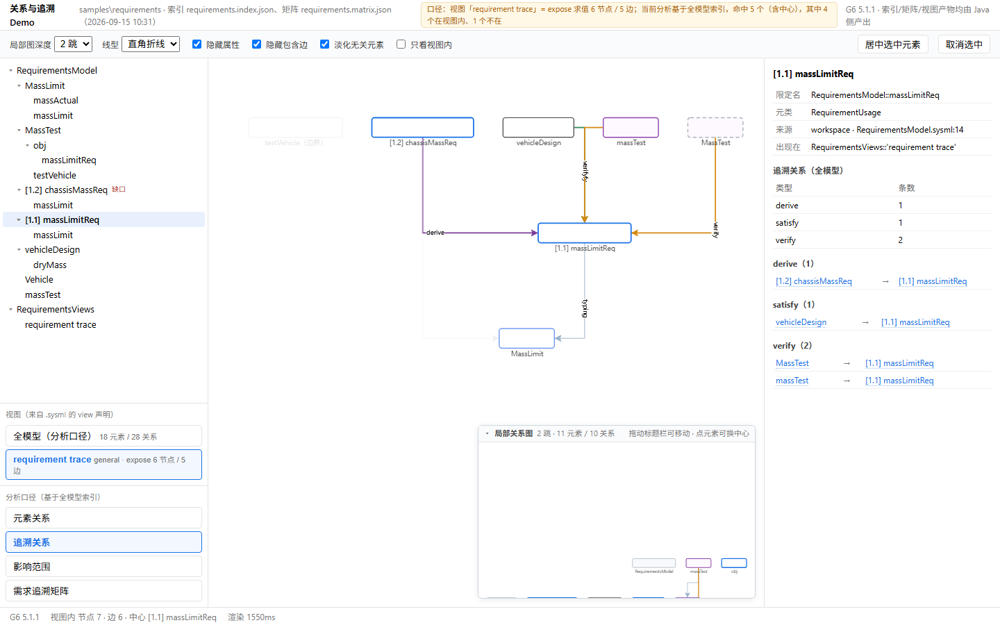
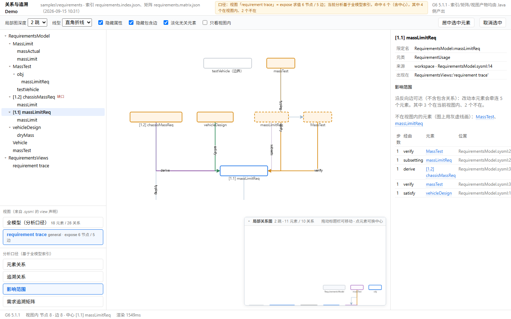
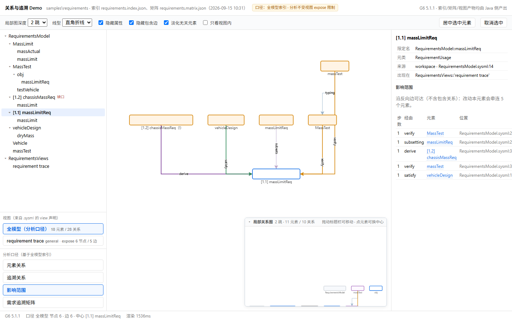
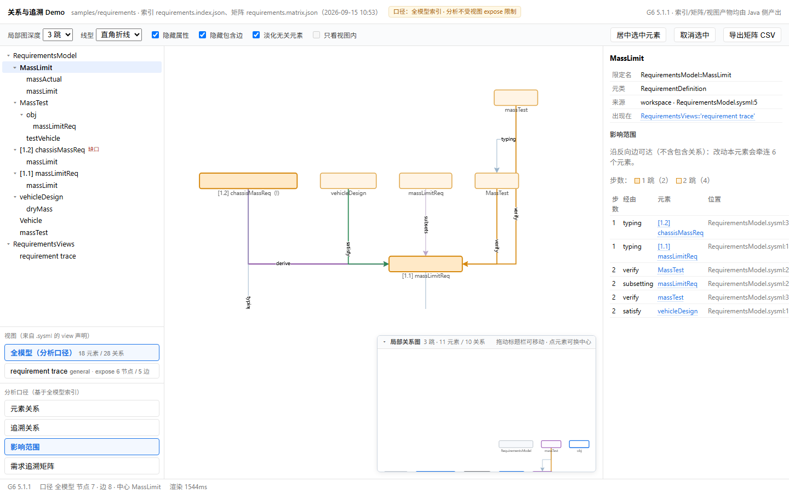
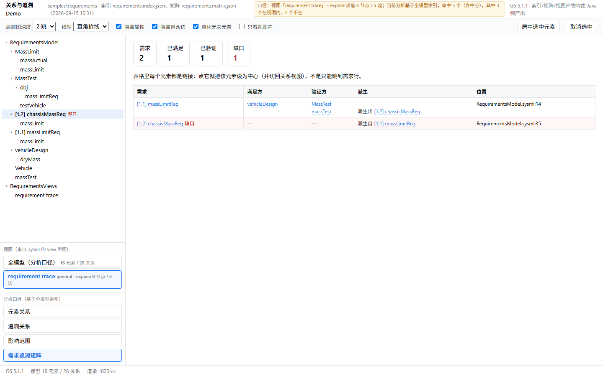
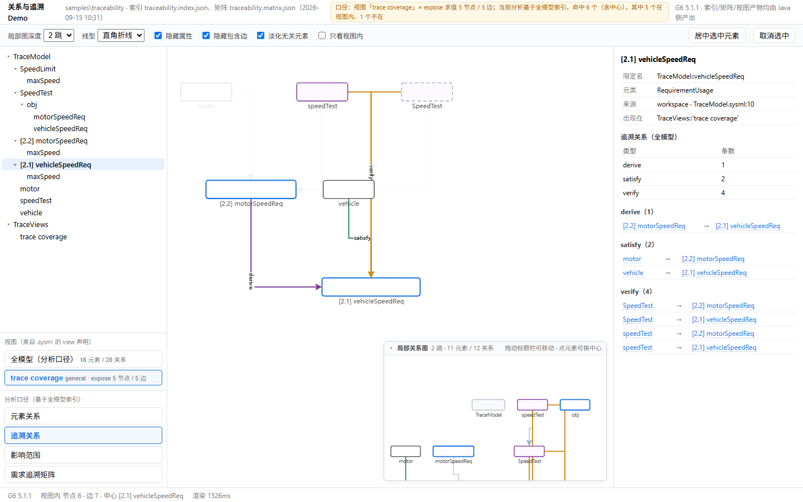
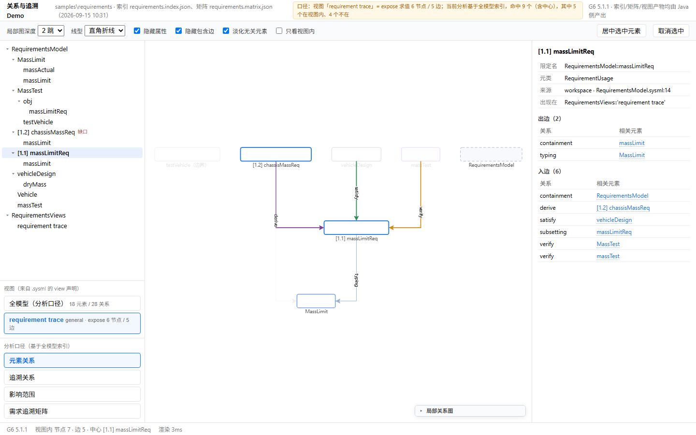
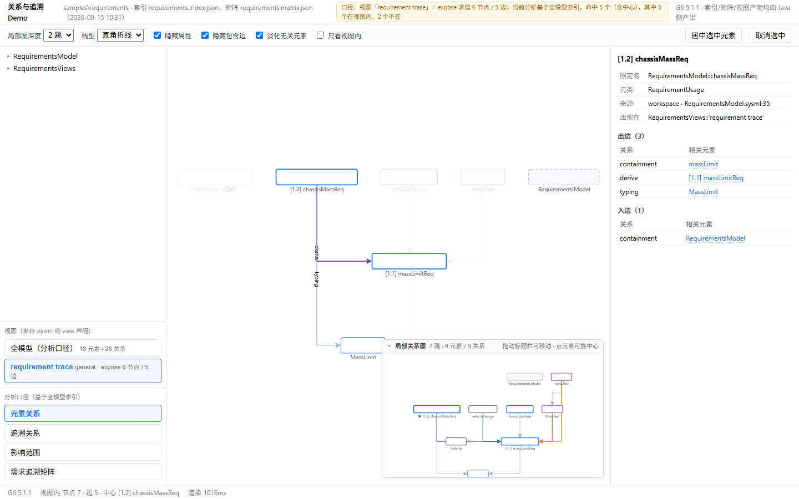

# 关系与追溯 Demo（G6 展示层）

用途：把阶段 3 的语义能力——**元素关系、局部关系图、追溯关系、影响范围、需求追溯矩阵**——
在选定的 G6 展示层上做成可点可看的 Demo，并把**视图（expose 投影）**与**分析（全模型遍历）**
两种口径在界面上分开。

日期：2026-09-15（第三版，补上视图链）。生成器 `scripts/make-relation-demo.py`，
截图工具 `scripts/measure-proto.py`。文中的图都是无头 Chrome 打开 Demo 页后的实机截图
（1440×900），不是示意图。

## 1. 这一版补了什么

上一版只有一个数据源（全模型索引），界面上却把四个分析口径标成"视图模式"，导致
"元素关系列出了模型里所有元素、没有经过 view/expose"的歧义。这一版把三条链都接上，并在界面上分开：

```
Java 侧导出三条链
  ├─ -AllViews <dir>   每个 ViewUsage 一份产物   → 【视图】：expose + filter 求值结果
  ├─ -Index  <file>    全模型索引                → 【分析口径】的底座
  └─ -Matrix <file>    全模型追溯矩阵            → 【分析口径】里的矩阵
```

左侧栏现在是两组单选项：

| 组 | 内容 |
|---|---|
| **视图（来自 .sysml 的 view 声明）** | `全模型（分析口径）` + 工作区里每一个 `view`（带 kind 与 expose 求值出的节点/边数） |
| **分析口径（基于全模型索引）** | 元素关系 · 追溯关系 · 影响范围 · 需求追溯矩阵 |

页头常驻一行口径说明：选了视图时写"口径：视图「X」= expose 求值 6 节点 / 5 边；当前分析基于
全模型索引，命中 N 个（含中心），其中 K 个在视图内、M 个不在"。

## 2. 两种口径怎么区分

| | 视图口径 | 分析口径 |
|---|---|---|
| 数据源 | `-AllViews` 产物（每个 ViewUsage 一份） | `-Index` 全模型索引 |
| 是什么 | `expose` + `filter` 求值出来的**子集** | 模型里**所有**元素与关系 |
| 谁说了算 | `.sysml` 里写的 `expose` | 语义层（索引） |
| 在界面上 | 左侧"视图"组 | 左侧"分析口径"组 |
| 会不会互相影响 | **不会**：视图不影响分析结果 | **不会**：分析不受 expose 边界限制 |

分析口径下选了某个视图时，二者的**差集会被显式画出来**：分析命中的元素如果在当前视图外，
用**灰虚线**画（并统计个数），可以一键"只看视图内"把它收掉。



图中口径是视图 `requirement trace`（expose 求值 6 节点 / 5 边），中心是 `[1.1] massLimitReq`：
视图内元素实线，`RequirementsModel`（包，不在该视图的 expose 里）用灰虚线补画——
它出现在分析结果里，但确实不属于这个视图。

## 3. 分析口径：元素关系 / 追溯关系 / 影响范围

三者都建立在全模型索引上，区别只在跟随哪些边、朝哪个方向（详见第 8 节）。

**追溯关系**：只留 `satisfy`（绿）/ `verify`（橙）/ `derive`（紫），右面板按类型给条数与清单：



**影响范围**：沿反向边可达（不含包含关系），右面板给出步数 / 经由 / 元素 / 位置，
节点**按步数分色**（1 跳最深、越远越浅，面板里有图例），并直接写明"其中 K 个在当前视图内、
M 个不在"，视图外的成员在画布上是灰虚线：



同一个影响范围，把口径切到**全模型**就是纯粹的模型视角（不标视图差集，因为此时没有可比对象）：



多跳的例子（中心是需求定义 `MassLimit`，1 跳 2 个、2 跳 4 个，图上深浅分明）：



## 4. 需求追溯矩阵

矩阵本来就是全模型口径（`--matrix`），顶部四块统计：需求 / 已满足 / 已验证 / 缺口；
表格里**每个元素都是链接**，点满足方就跳到满足方，点需求行才跳到需求。
工具栏的"导出矩阵 CSV"把同一份数据导成带 BOM 的 CSV（Excel 直接打开，中文不乱码），
方便进评审材料：

```
需求编号,需求,满足方,验证方,派生自,派生出,文件,行,缺口
"1.1","massLimitReq","vehicleDesign","MassTest massTest","","chassisMassReq","RequirementsModel.sysml","14",""
```

工具栏的"导出画布 PNG"走 G6 自己的 `toDataURL`（整图，不限于当前视口），文件名带上
工作区 / 视图 / 分析口径（例如 `requirements-requirement%20trace-impact.png`），
从文件名就能看出这张图是什么口径。



`samples/requirements`：需求 2、已满足 1、已验证 1、**缺口 1**（`[1.2] chassisMassReq` 由 `[1.1]`
派生而来，却没有满足方和验证方）。换到 `samples/traceability` 则全闭合：



## 5. 局部关系图（右下角，可折叠可拖动）

以当前中心为起点、N 跳内的邻域，常驻右下角小画布，与主视图同步（同一套筛选、同一套分析口径）；
点小图里的元素可以换中心。它是一块白底浮层，会盖住画布右下角，所以标题栏可以：



- 点左侧箭头**折叠**（折叠后只剩一条标题栏，下面被它盖住的画布露出来）；
- 按住标题栏**拖动**到任意位置；
- 面板半透明（`rgba(255,255,255,.94)`），压住的元素还能看出轮廓。

元素树也是可折叠的真树（命名空间层级 + 箭头 + 缩进）：



## 6. 交互约定

| 反馈/需求 | 现在的行为 |
|---|---|
| 视图与分析要分开 | 左侧两组单选：**视图**（来自 `.sysml`）与**分析口径**（基于全模型索引）；页头常驻口径说明 |
| 分析必须全模型 | 追溯 / 影响范围 / 局部关系 / 矩阵都走索引，不受 `expose` 边界影响 |
| 差集要看得见 | 视图口径下，分析命中但**不在视图内**的元素用灰虚线补画，面板列出名字并计数 |
| 元素树不像树 | 真树：折叠箭头 + 缩进，可全部展开/折叠 |
| 关系表里元素不是链接 | 面板与矩阵里的元素一律可点（蓝字 + 虚线下划线） |
| 模式占上方横栏 | 模式列表在左侧栏下方；横栏只放标题、筛选与两个动作按钮 |
| 局部图希望单独放右下角 | 右下角常驻小画布，跟随中心与深度，套用同一套筛选 |
| 矩阵只能跳需求 | 单元格级链接，点谁选谁 |
| 选中后无法取消 | 点画布空白、`Esc`、工具栏"取消选中" |
| 选中后自动居中、视图跳得厉害 | 选中只改高亮不动视口；居中要在树上再点一次、双击节点或点"居中选中元素" |
| 线型只有直线 | 默认直角折线（G6 polyline + `router:orth`），可切直线 / 圆滑曲线 |
| 右下角白底挡住元素 | 小图可折叠、可拖动、半透明 |
| 跨视图跳转 | 元素详情里的"出现在"是**可点的视图链接**：点了就切到那个视图口径，中心保持选中 |
| 影响范围看不出远近 | 按步数分色（1 跳最深、越远越浅）+ 面板图例与逐行步数 |
| 矩阵要能带走 | 工具栏"导出矩阵 CSV"（带 BOM，Excel 直接打开） |
| 画布要能带走 | 工具栏"导出画布 PNG"（G6 `toDataURL`，文件名带工作区/视图/口径） |

## 7. 可核验的证据

**一、视图口径 = expose 求值结果**（与 Java `-AllViews` 的打印逐项一致）：

| 工作区 | 视图 | Demo 页视图口径 | Java `-AllViews` |
|---|---|---|---|
| `samples/requirements` | `RequirementsViews::'requirement trace'` | 6 节点 / 5 边 | `nodes=6 edges=5` |
| `samples/traceability` | `TraceViews::'trace coverage'` | 5 节点 / 5 边 | `nodes=5 edges=5` |

**二、分析口径 = 全模型**（页面在视图口径下依然报全模型数字）：

| 量 | Demo 页 | Java 命令 |
|---|---|---|
| 全模型规模 | 18 元素 / 28 关系 | `-Index` → `elements=18 relations=28` |
| `massLimitReq` 影响范围 | 5 个元素（全部 1 跳） | `--query impact --ref … --depth 3` → 合计 5 |
| `massLimitReq` 2 跳子图 | 16 节点 / 27 边 | `--query subgraph --ref … --depth 2` → nodes=16 edges=27 |
| 追溯矩阵 | 需求 2 / 已满足 1 / 已验证 1 / 缺口 1 | `-Matrix` → requirements=2 satisfied=1 verified=1 gaps=1 |

**三、差集 = 界面上那些灰虚线**（页内 `report().counts`，由测量工具取回）：

| 状态 | 视图口径 | 分析命中 | 视图内 | 视图外（灰虚线） |
|---|---|---|---|---|
| 元素关系，中心 `massLimitReq` | 6/5 | 9 | 5 | 4 |
| 影响范围，中心 `massLimitReq` | 6/5 | 6（含中心） | 4 | 2 → `MassTest`、`MassTest::obj::massLimitReq` |
| 追溯关系 | 6/5 | 5 | 4 | 1 |
| 切到全模型口径 | — | 6 | — | —（没有可比对象，不标） |

视图外那两个正好说明问题：`MassTest` 是 `verification def`，`MassTest::obj::massLimitReq` 是
`objective { verify … }` 生成的包装用法——**两者都不在任何视图里，但都是真实关系的端点**。
如果拿视图边界去裁剪追溯/影响分析，这两条依赖就会丢。

**四、选中不动视口**（页内操作历史）：

| 操作 | zoom | 平移 |
|---|---|---|
| 选中 `massLimitReq` | 0.616 | [16, 288] |
| 再选中 `vehicleDesign` | 0.616 | [16, 288] ← 没动 |
| 显式居中 `vehicleDesign` | 0.616 | [176, 374] ← 只有这一步动 |

**五、新增三项的页内数字**：

| 项 | 页内读数 |
|---|---|
| 影响范围按步数分色 | 中心 `MassLimit`：1 跳 2 个、2 跳 4 个（`impactByDepth={'1':2,'2':4}`） |
| 矩阵 CSV | 2 行数据 / 227 字节，首行 `"1.1","massLimitReq","vehicleDesign","MassTest massTest","","chassisMassReq","RequirementsModel.sysml","14",""` |
| 画布 PNG | `toDataURL` 返回的数据 URL 约 42 KB（页内读数），无报错 |
| 跨视图跳转 | 详情里"出现在 `RequirementsViews::'requirement trace'`"可点，点击后口径切到该视图且中心不丢 |

## 8. 追溯关系、影响范围、局部关系：同一底座上的三种遍历

不是"局部关系的扩展"，而是**同一份索引上的三种遍历**（页内与 Java 侧同名同算法）：

| | 局部关系图（右下角） | 追溯关系 | 影响范围 |
|---|---|---|---|
| 跟随的边 | 全部关系类型 | 只有 satisfy / verify / derive | 依赖类 12 种，排除包含 |
| 方向 | 无向（结构邻域） | 有向 | 反向可达 |
| 回答 | 它周围有什么 | 谁满足/验证/派生了它 | 改了它会波及什么 |
| 呈现 | 右下角常驻小图 | 主图过滤模式 + 右侧清单 | 主图高亮 + 按步数分层的表 |
| 口径 | 全模型 | 全模型 | 全模型 |

三者都可以在**视图口径**下看：图按视图投影画，分析结果里视图外的部分灰虚线标出。

## 9. 怎么复现

```powershell
# 1. 三条链（都只跑小样例，单次十秒级）
powershell -ExecutionPolicy Bypass -File scripts\run-view.ps1 -Workspace samples/requirements `
    -AllViews build\demo-data\requirements.views          # 视图产物（每个 view 一份）
powershell -ExecutionPolicy Bypass -File scripts\run-view.ps1 -Workspace samples/requirements `
    -Index build\demo-data\requirements.index.json        # 全模型索引
powershell -ExecutionPolicy Bypass -File scripts\run-view.ps1 -Workspace samples/requirements `
    -Matrix -Out build\demo-data\requirements.matrix.json # 全模型矩阵

# 2. 生成单文件 Demo 页
python scripts\make-relation-demo.py --workspace samples/requirements `
    --out build\demo\requirements.html `
    --lib build\vendor\node_modules\@antv\g6\dist\g6.min.js --reuse

# 3. 截图 / 脚本化交互（可选）
python scripts\measure-proto.py --html build\demo\requirements.html `
    --shot docs\images\relation-demo\01-view-relation.png `
    --call "window.__PROTO.run('scope','model')" `
    --call "window.__PROTO.run('mode','impact')"
```

页面脚本接口：`run('scope'|'mode'|'center'|'link'|'treePick'|'clear'|'centerView'|'depth'|'filter'|
'onlyView'|'edgeKind'|'collapseAll'|'expandAll'|'row', arg)`；
`report()` 返回口径、命中、视图内外拆分、视口与操作历史。

## 10. 已知限制

- **不是产品形态**：单文件页、面向演示；没有导出（PNG/SVG），没有跨视图跳转按钮。
- **端口与仓格不在这个 Demo 里**：它讲元素之间的关系，不是单个元素内部结构；
  那部分见 `docs/GRAPH-LIB-P1.md`。
- **大模型要先筛后画**：演示规模是几十个元素；上千元素时应先按包/需求号限定范围，
  目前页内计算是全量遍历。
- **视图口径下的"视图外"补画**：只补分析命中到的元素（不是整个模型），避免把画布塞满；
  要看全模型请切到"全模型（分析口径）"。
- **静态截图看不到交互**：拖动、缩放、悬停、小图折叠/拖动需要在浏览器里实际操作。

## 11. 下一步

| 项 | 说明 |
|---|---|
| SVG 导出 | 画布已能导 PNG（`toDataURL`）；SVG 需要 `@antv/g-svg` 渲染器，当前 bundle 里没有，未做 |
| 局部关系图接 `--local-view` | 现在页内自己算；接上 Java 产物后可复用同一份导出 |
| 大图策略 | 先筛后画（按包/需求号），再走"关系 → 局部图"的路径 |
